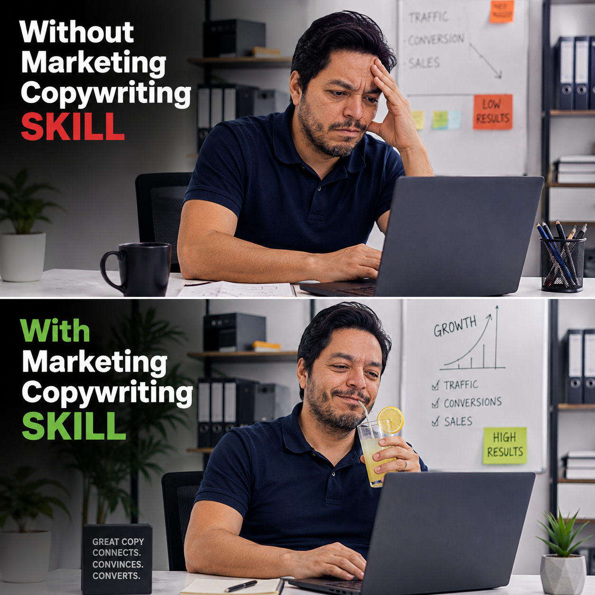

# Marketing Copywriting



## 😐 Generic prompt in. Generic copy out.🙄 

Marketing Copywriting gives any AI agent 63 named rhetorical and persuasion techniques to turn a copy goal—or a weak draft—into a deliberate direction. It recommends the technique that fits, explains why, and returns labeled options you can actually choose between.

Use it to create or improve headlines, taglines, CTAs, ads, email subject lines, social captions, and landing-page copy—without settling for another vague rewrite.

## What it does

Given a goal, existing copy, or both, the skill:

1. identifies assumptions and asks one useful follow-up when context is missing;
2. diagnoses submitted copy before rewriting it;
3. recommends suitable techniques and when to use each;
4. writes the requested number of labeled copy options; and
5. suggests a next refinement or test.

A goal alone or an existing line alone is enough to begin. The skill does not block on ordinary missing context; it states its assumptions and generates a useful first direction. It pauses only when missing information could make a claim inaccurate or unsafe.

## Install

Copy the `marketing-copywriting/` directory, including `references/`, into your agent's skills directory. The directory is self-contained and uses relative references, so its instructions are not tied to one agent.

| Agent | Project install location |
| --- | --- |
| Claude Code | `.claude/skills/marketing-copywriting/` |
| Codex CLI | `.agents/skills/marketing-copywriting/` |
| Cursor | `.cursor/skills/marketing-copywriting/` |
| Gemini CLI | `.gemini/skills/marketing-copywriting/` |
| Pi | `.agents/skills/marketing-copywriting/` or `~/.pi/agent/skills/marketing-copywriting/` |

Restart or reload your agent after installing. If an agent uses a different configured skills directory, copy the same folder there.

## How to use it

Ask naturally, or invoke the skill through your agent's native skill command. Include any details you have: goal, product, audience, channel, tone, output type, or existing copy. None are required.

For a terse expert response, start with **`Direct mode:`** or **`Just the copy:`**. The skill still names the recommended technique, but skips exploratory advice unless you ask for it.

### Goal-only copy

> Write three homepage headlines to get demo bookings for a payroll app for small businesses.

The skill recommends conversion-oriented techniques, explains the fit, and returns exactly three labeled headlines.

### Diagnose and rewrite submitted copy

> Improve this line for a bookkeeping service: “We make accounting easy.” Our goal is more consultation bookings.

The skill explains what the line communicates, identifies its limitation, recommends stronger techniques, and provides rewrites.

### Brainstorm directions

> I need a bold campaign direction for a reusable water bottle. Give me options from safe to provocative.

The skill recommends several technique directions, notes any risks, and provides examples across the requested range.

### Use a named technique

> Give me four Antithesis taglines for a project-management tool. Tone: confident, not corporate.

The skill uses Antithesis directly, explains its fit briefly, and returns exactly four options.

### Direct mode

> Direct mode: give me three email subject lines for a spring restaurant promotion. Playful tone.

The response stays concise: a one-line recommendation and three labeled subject lines.

## Technique examples

The library has 63 techniques. These examples show one from each group; see the [complete technique library](marketing-copywriting/references/copywriting-techniques.md) for construction rules, examples, usage guidance, and risks for every technique.

| Group | Example technique | Example |
| --- | --- | --- |
| Sound & Rhythm | Asyndeton | “Plan. Publish. Grow.” |
| Meaning & Contrast | Antithesis | “Less busywork. More best work.” |
| Tone & Brand Personality | Self-Deprecation | “Our first prototype had feelings. Mostly panic.” |
| Persuasion Structures | Time to Value | “From signup to first report in ten minutes.” |
| Positioning, Pain & Competition | Stop the Pain | “Stop losing leads to an inbox nobody owns.” |

## Contents

```text
marketing-copywriting/
├── SKILL.md                          # Agent-neutral workflow
└── references/
    └── copywriting-techniques.md     # 63-technique library and usage guide
```

## License

MIT © Dax Castellón
